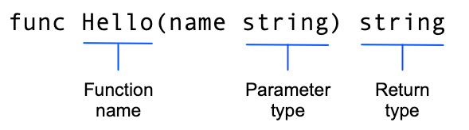

# go

Note

Creating from scratch call this command. `example.com/greetings` is module name 
```shell
$ go mod init example.com/greetings
```


image source: `https://golang.org/doc/tutorial/create-module`